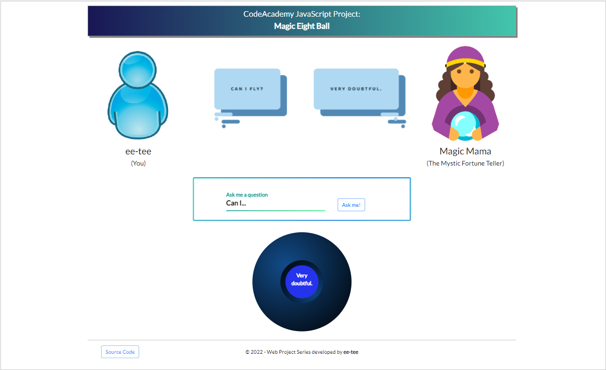
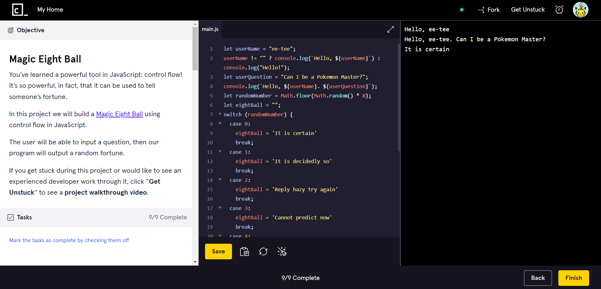

# magic-eight-ball
<b>CodeAcademy JavaScript Project: Magic Eight Ball</b>

(From the course: Learn JavaScript)

Description:  
You’ve learned a powerful tool in JavaScript: control flow! It’s so powerful, in fact, that it can be used to tell someone’s fortune.
In this project we will build a Magic Eight Ball using control flow in JavaScript.
The user will be able to input a question, then our program will output a random fortune.

 

<b>© 2022 - Web Project Series developed by ee-tee</b>

Now that I have built my JS magic eight ball, it's time to set up my fortune telling business. 
Presenting... Magic Mama the Mystic Fortune Teller at your service! 🔮✨

In this web edition, the user can access the fortune teller service through their browser. Tell me your name and any burning questions you have, and Magic Mama will read the stars and predict the future with the help of the magical eight ball.

<u>!!!Disclaimer!!!</u> 
This is just for entertainment purposes, please don't take the answers too seriously. 
Whether good or bad, life goes on so try again or move on and just do your best! 

Try out the game at the link below and I hope you will enjoy playing it too! (>‿◠)✌

 

 

Browser Version: <a href="https://ee-tee.github.io/magic-eight-ball/">https://ee-tee.github.io/magic-eight-ball/</a>

(magicEightBallWeb.js)

 

Normal Version:

(magicEightBall.js)

